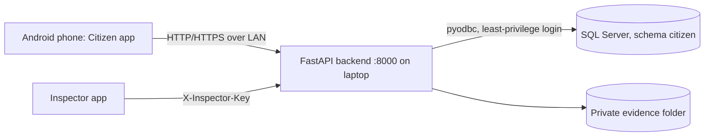
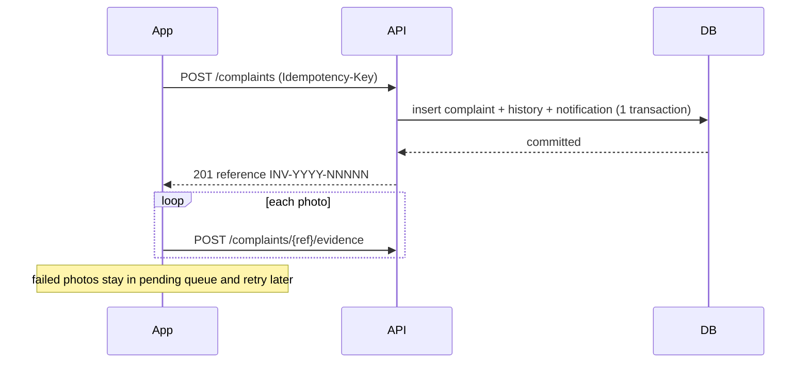
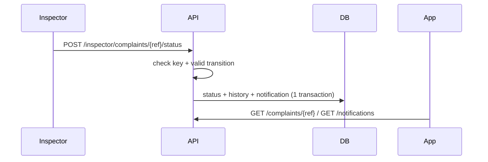
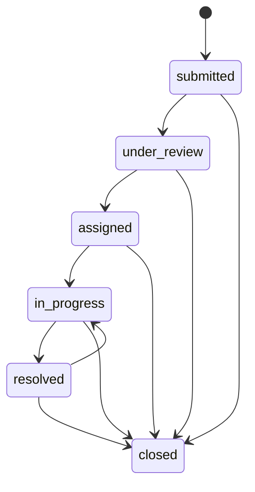
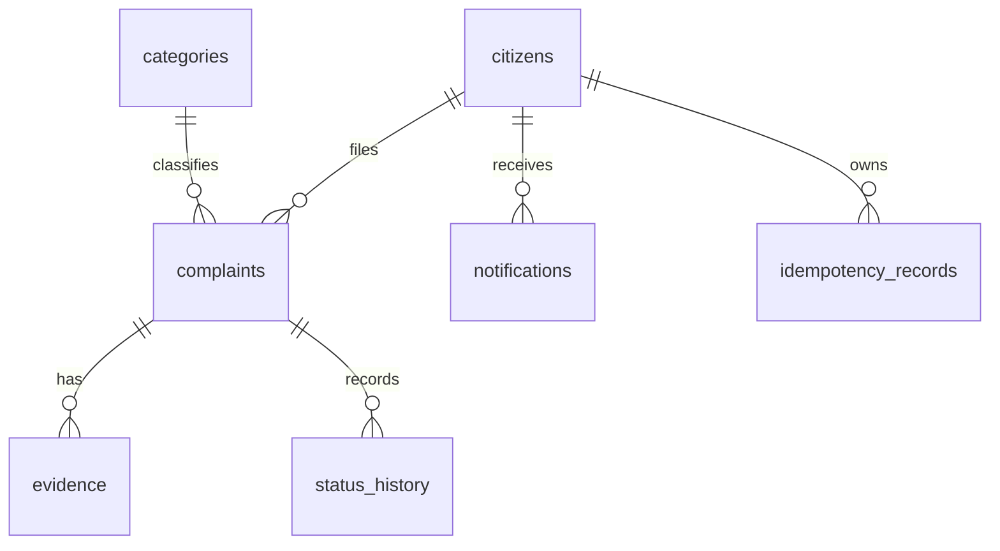

# Diagrams (match the current implementation)

## System and network topology

```mermaid
flowchart LR
  A[Android phone: Citizen app] -- HTTP/HTTPS over LAN --> B[FastAPI backend :8000 on laptop]
  B -- pyodbc, least-privilege login --> C[(SQL Server, schema citizen)]
  B --> E[(Private evidence folder)]
  I[Inspector app] -- X-Inspector-Key --> B
```

## Complaint submission

```mermaid
sequenceDiagram
  participant App
  participant API
  participant DB
  App->>API: POST /complaints (Idempotency-Key)
  API->>DB: insert complaint + history + notification (1 transaction)
  DB-->>API: committed
  API-->>App: 201 reference INV-YYYY-NNNNN
  loop each photo
    App->>API: POST /complaints/{ref}/evidence
  end
  Note over App: failed photos stay in pending queue and retry later
```

## Inspector status update

```mermaid
sequenceDiagram
  Inspector->>API: POST /inspector/complaints/{ref}/status
  API->>API: check key + valid transition
  API->>DB: status + history + notification (1 transaction)
  App->>API: GET /complaints/{ref} / GET /notifications
```

## Complaint lifecycle

```mermaid
stateDiagram-v2
  [*] --> submitted
  submitted --> under_review
  under_review --> assigned
  assigned --> in_progress
  in_progress --> resolved
  resolved --> closed
  resolved --> in_progress
  submitted --> closed
  under_review --> closed
  assigned --> closed
  in_progress --> closed
```

## Database relationships

```mermaid
erDiagram
  citizens ||--o{ complaints : files
  categories ||--o{ complaints : classifies
  complaints ||--o{ evidence : has
  complaints ||--o{ status_history : records
  citizens ||--o{ notifications : receives
  citizens ||--o{ idempotency_records : owns
```
